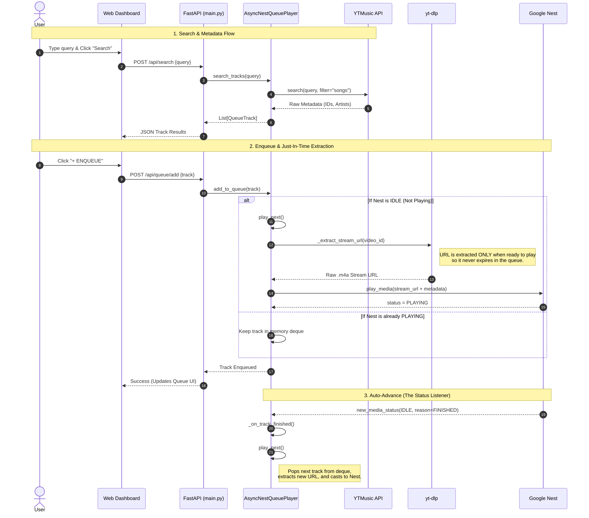

# 🎵 Google Nest Streamer


A fully local, containerized web application that allows you to search YouTube Music and cast audio streams directly to your Google Nest / Chromecast speakers. 

Built with **FastAPI**, **yt-dlp**, and **PyChromecast**, this application acts as a local bridge, enabling custom queue management and full Google Assistant voice control integrations without requiring a premium music subscription.

---

## ✨ Features

- 🔍 **Native Search:** Search the YouTube Music database directly from the dashboard.
- 🎙️ **Voice Control Ready:** Injects rich metadata (Type 3 Media) into the Chromecast stream so commands like *"Hey Google, pause"* or *"Hey Google, what song is this?"* work natively.
- 📜 **Smart Queue Management:** In-memory queue system that automatically listens for speaker idle states and seamlessly advances to the next track.
- ⚡ **Just-In-Time Extraction:** Extracts raw stream URLs only moments before playback to prevent URL expiration errors.
- 🎛️ **Modern Dashboard:** A high-contrast, responsive web UI (Yellow/Black aesthetic) that acts as a real-time smart remote.
- 🐳 **Dockerized:** Fully containerized for instant deployment on any machine on your local network (Raspberry Pi, Home Server, PC, or Mac).

---

## 📐 System Architecture (UML)



---

## 🛠️ Architecture & Tech Stack

* **Backend:** FastAPI (REST API), Python `asyncio` for non-blocking network I/O.
* **Media Protocols:** `pychromecast` (Google Cast protocol over port 8009).
* **Data Sources:** `ytmusicapi` (Metadata search), `yt-dlp` (Audio stream extraction).
* **Frontend:** Vanilla HTML/JS/CSS (No build step required, lightweight and fast).

---

## 🚀 Quick Start (Docker)

The absolute easiest way to run this application is via Docker. 

### 1. Prerequisites
* [Docker](https://docs.docker.com/get-docker/) and [Docker Compose](https://docs.docker.com/compose/install/) installed.
* Your Google Nest speaker must be powered on, connected to your local Wi-Fi network, and you need to know its **IP Address** (e.g., `192.168.XX.XX`). You can find this in the Google Home app under device settings.

### 2. Clone and Run
Clone this repository to your local machine:
```bash
git clone https://github.com/yourusername/nest-music-streamer.git
cd nest-music-streamer
```

Start the container in the background:
```bash
docker-compose up -d --build
```

### 3. Access the Dashboard
Open your web browser and navigate to:
```
http://localhost:5000
```
*(If you are running this on a headless server or Raspberry Pi, replace `localhost` with the server's IP address).*

---

## 💻 Manual Installation (Without Docker)

If you prefer to run the application directly using Python, follow these steps:

1. Create a virtual environment and install dependencies:
   ```bash
   python -m venv venv
   source venv/bin/activate  # On Windows use: venv\Scripts\activate
   pip install -r requirements.txt
   ```
2. Start the Uvicorn server:
   ```bash
   uvicorn main:app --host 0.0.0.0 --port 5000
   ```
3. Open `http://localhost:5000` in your browser.

---

## 🕹️ How to Use

1. **Connect:** Enter your Google Nest's IP address in the top-right corner of the dashboard and click **Connect**. The status badge will turn yellow and say `LINKED` once the handshake is successful.
2. **Search:** Use the search bar to find an artist or track.
3. **Queue:** Click **+ ENQUEUE** next to a search result. If the speaker is idle, the song will begin buffering and playing immediately.
4. **Control:** Use the Player Widget to pause, skip, stop, or adjust the speaker's volume. All state changes synchronize automatically every 2 seconds.

---

## ⚠️ Troubleshooting

| Issue | Solution |
| :--- | :--- |
| **Cannot reach `localhost:5000`** | Ensure the container is running (`docker ps`). If on Mac/Windows, verify that port `5000:5000` is mapped in your `docker-compose.yml`. |
| **Nest device fails to connect** | Ensure the IP address is correct. Ensure your host machine (or Docker container) is on the **same subnet** as the Nest speaker. |
| **Song skips immediately** | Occasionally, YouTube implements rotating cipher algorithms. Try updating `yt-dlp` in your requirements (`pip install --upgrade yt-dlp`) and rebuilding the container. |

---

*Disclaimer: This project uses unofficial APIs (`ytmusicapi`, `yt-dlp`) and is meant for personal, non-commercial use on local networks.*
